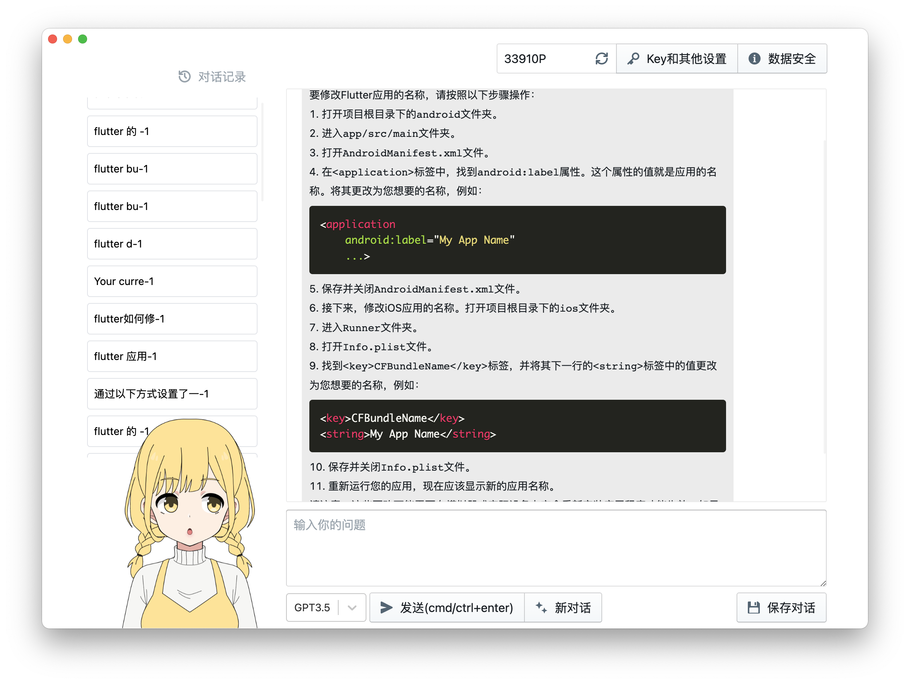
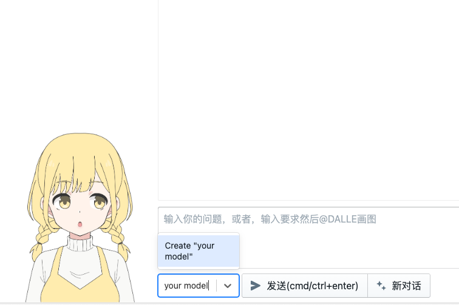
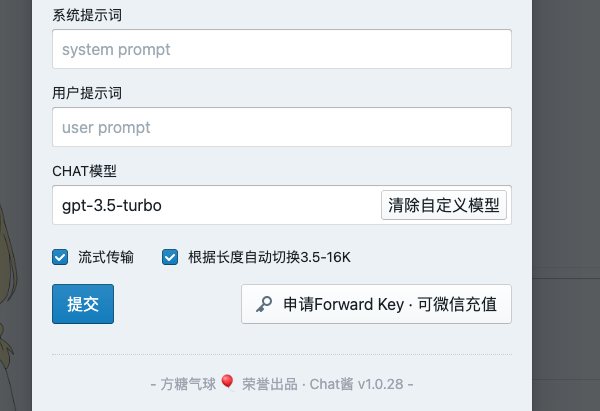
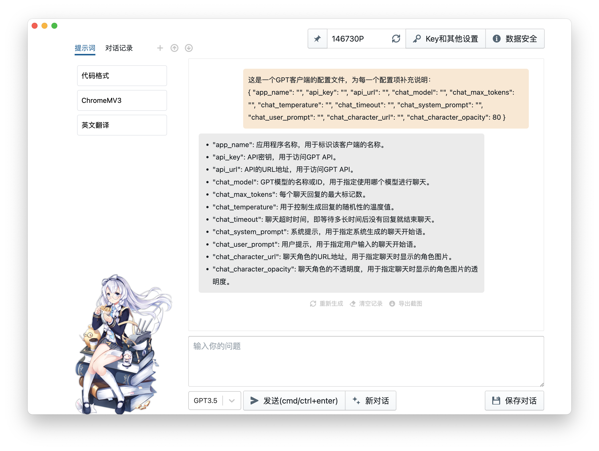
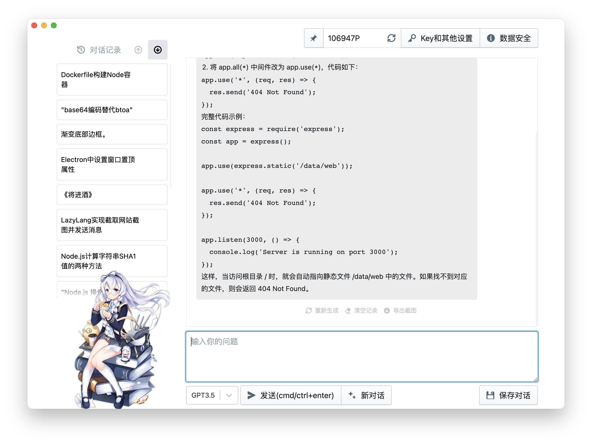
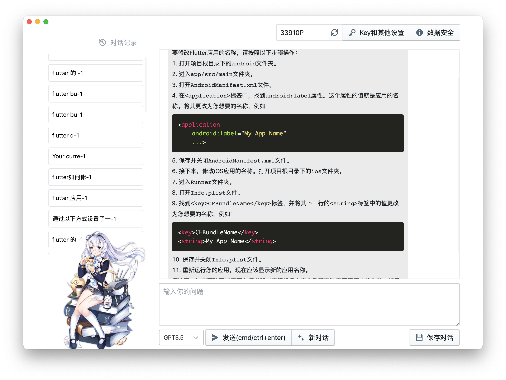
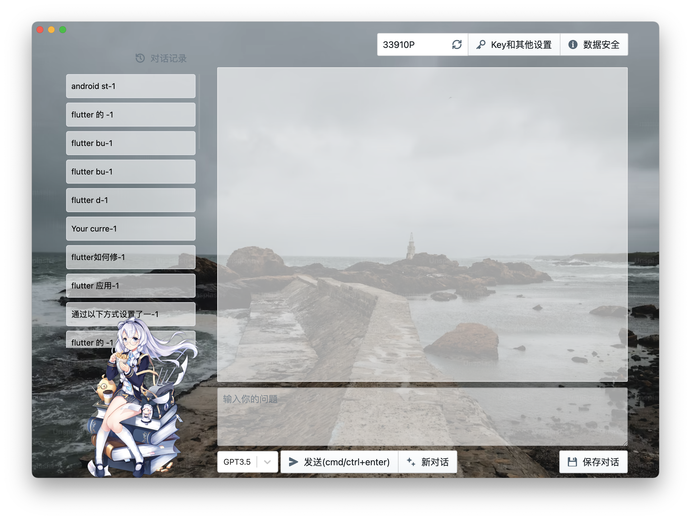
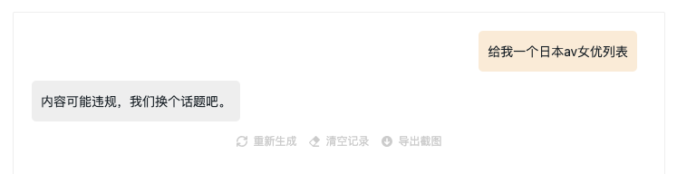
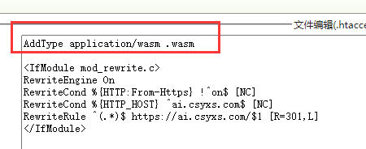

推荐使用浏览器插件，除了载入更快，还支持边栏

## 浏览器插件

|微软Edge|谷歌Chrome|
|-|-|
| [](https://microsoftedge.microsoft.com/addons/detail/aakifgfhadhkcflbkjbhbamljjchpkho) |[](https://chrome.google.com/webstore/detail/knadnllihfobgmmeanknpnklccjhiolf)  |


点以上图标进入商店页面或者直接在商店搜索「Check酱」即可

> ⚠️ 可 watch 本 repo 以获得在线版最新地址

在线版最新地址 [c3.level06.com](https://c3.level06.com)

# Chat酱独立部署版

> 🎈 Chat酱定制版发布，支持自定义推荐链接、限制使用的Key。[详情请点此查看](https://a.ftqq.com/2023/04/24/chatyou-custom-platform/)。

## 默认界面



## 最近更新

v1.0.28

支持用户添加自定义模型，可在设置界面和选择框处输入。可在设置界面清除。



历史更新见最后


### 常用提示词、点击后会自动填入输入框



### 独立部署版，支持设置默认账号、模型参数、和聊天助手信息

解压 build.zip 后，编辑目录下的 `default.json` 文件，修改对应项内容后保存即可。

> ⚠️ 使用本地浏览器无法载入配置，需要启动http服务

```json
{
    "app_name": "",
    "api_key": "",
    "api_url": "",
    "chat_model": "",
    "chat_max_tokens": "",
    "chat_temperature": "",
    "chat_timeout": "",
    "chat_system_prompt": "",
    "chat_user_prompt": "",
    "chat_character_url": "",
    "chat_character_opacity": 80
}
```
每一项的意义如下：

- "app_name": 应用程序名称，用于标识该客户端的名称。
- "api_key": OpenAI/Api2d Key。
- "api_url": API的URL地址，OpenAI的是 https://api.openai.com ; Api2d的是 https://openai.api2d.net 。
- "chat_model": GPT模型的名称，`gpt-3.5-turbo` 或者 `gpt-4` 。
- "chat_max_tokens": 每个聊天回复的最大标记数。
- "chat_temperature": 用于控制生成回复的随机性的温度值。
- "chat_timeout": 聊天接口超时时间，单位为秒。
- "chat_system_prompt": 系统提示，用于指定系统生成的聊天开始语。
- "chat_user_prompt": 用户提示，用于指定用户输入的聊天开始语。
- "chat_character_url": 聊天角色的URL地址，用于指定聊天时显示的角色图片。
- "chat_character_opacity": 聊天角色的不透明度，用于指定聊天时显示的角色图片的透明度。


v1.0.5 



- 支持上传和下载对话记录
- 支持重新生成答案
- Docker版自带OpenAI代理，请把自定义地址填为 `http://你的IP:你的端口`，然后请求会从服务器端发送到`api.openai.com`。（请确保Docker部署的环境可以访问api.openai.com）

代理支持访问密码、内容安全、超时设置等，[请点击这里查看详细的环境变量](https://github.com/easychen/openai-api-proxy)


v1.0.2 

- 支持自动保存对话，支持总结对话标题



- 支持自定义背景




Chat酱网页版（[c2.level06.com](https://c2.level06.com)）部署在海外服务器，有部分同学访问不了，因此提供一个独立部署版，你可以将它部署到任何服务器，甚至在电脑直接用支持浏览本地网页的浏览器打开使用。

## 使用方法

1. 下载 [build.zip](./build.zip) 
1. 解压后，你会得到一个完整的网站，访问 index.html 即可使用，如果你的浏览器不支持查看本地网页，那么可以下载我打包这些网页的桌面客户端（ 链接：https://share.weiyun.com/jXtYKbZS 密码：chatok ）
1. 如果要给其他同学使用，可以把这个目录部署到服务器上，然后访问对应目录就行。

## Docker版

虽然我觉得静态网页更简单，但有同学表示想要docker版，于是我让GPT写了个Dockerfile，于是就有了docker版。

使用方法：

不设置默认信息：

```bash
docker run -d -p 9000:9000 easychen/chatchan:latest
```

设置默认信息，首先要保证运行命令的目录下存在 `default.json`：
```bash
docker run -d -p 9000:9000 -v $(pwd)/default.json:/data/web/default.json easychen/chatchan:latest
```

对话截图：


## 历史更新


v1.0.24

支持 @DALLE 生成图片，更新GPT4模型到0125最新版


v1.0.22

支持 GPT4+、GPT4V模型；支持聊天时发送图片


v1.0.21

修正参数错误的400错；3.5模型支持根据长度自动在4K和16K之间自动切换

v1.0.18

导出截图时隐藏「复制代码」按钮；「保存对话」添加成功提示

v1.0.17

修复额外审核选项导致直接使用 OpenAI 时报错的问题。

v1.0.16

default.json 添加强制审核选项，使用API2D的Key时可以开启该选项。开启后，返回的内容将会送后发送给腾讯云内容安全接口审核，因此响应速度会变慢，费用为每次10P。

开启方式：在 default.json 中添加 `chat_moderation` 字段，为 `on` 时，会审核并拦截输出。

```
{
    "app_name": "",
    "api_key": "",
    "api_url": "",
    ...
    "chat_moderation": "off"
}
```

开启效果：



v1.0.15

兼容 stream 模式下输出的错误信息

v1.0.14

添加api2d api地址切换按钮

v1.0.13

支持3.5 16K，代码块支持一键复制，去掉对话内容双击填回发布空

v1.0.12 

输入框根据内容自动伸缩，流式输出支持实时渲染Markdown（而不是等输入完成后再渲染）

v1.0.11

修正切换窗口时，重复发送请求的bug。

v1.0.10

支持手动和自动语音朗读（仅API2D的Key）


v1.0.8

兼容部分无法支持 wasm 的 hosting 环境。但兼容的方式是直接跳过，因此可能出现内容超长导致的400错误，建议按下边的提示添加对 Wasm MIME 的支持以获取完整的功能。


> 🚒 BreakingChange: 1.0.7 启用了 wasm 来计算 token，本地浏览器和部分主机环境不支持该类型的文件，需要手工添加支持，具体方法请询问GPT「如何给xxx(你使用的类型比如apache/nginx)服务器添加MIME TYPE 以支持 wasm」



v1.0.7

- Token可以精确计算了，内容超长不会再出现400错
- 支持删除单条聊天内容
- 载入对话记录添加撤销提示

v1.0.6 

- 支持添加常用提示词、点击后会自动填入输入框
- 独立部署版支持设置默认的账号、模型参数、和聊天助手信息